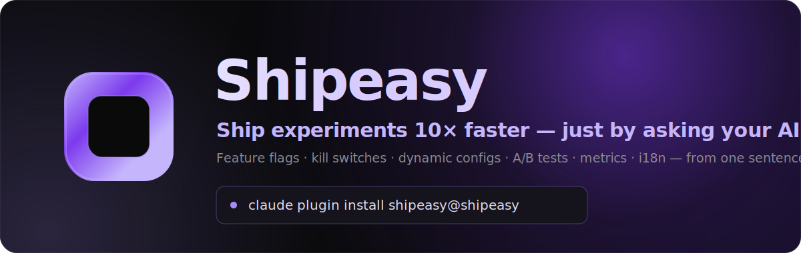

<div align="center">



<br/>

**Feature flags · kill switches · dynamic configs · A/B experiments · metrics · i18n — spun up from a single sentence to your AI coding agent.**

[](https://shipeasy.ai)
[](https://docs.shipeasy.ai)
[](https://github.com/shipeasy-ai/shipeasy/actions/workflows/contract-tests.yml)
[](https://github.com/shipeasy-ai/shipeasy/actions/workflows/prod-probe.yml)

[**Get started →**](#install-in-12-seconds) &nbsp;·&nbsp; [Website](https://shipeasy.ai) &nbsp;·&nbsp; [Docs](https://docs.shipeasy.ai) &nbsp;·&nbsp; [Command reference](./docs/reference.md)

</div>

---

## What is Shipeasy?

Shipeasy is the **AI-native experimentation platform**. Feature flags,
kill switches, dynamic configs, A/B tests, metrics and translations — all
controllable from where you already work: a sentence to your AI coding agent.

> *"Ship the new pricing page behind a flag at 5%."*
> *"Add a kill switch for checkout in case it breaks."*
> *"Run an A/B test on the signup button and tell me which wins."*

No dashboards to learn, no SDK boilerplate to hand-write. Shipeasy installs as
a **plugin into your coding agent** and an **MCP server**, so Claude Code (and
70+ other agents) can create the flag, instrument the metric, wire the SDK call,
and roll it out — end to end, from plain English.

This directory is the source-of-truth for that plugin marketplace.
**One plugin tree, many hosts** — the same `shipeasy/skills/` directory and the
same `shipeasy` MCP server feed every coding agent below. Each host gets a tiny
manifest that *points at* the shared files; nothing is duplicated.

## Why teams use it

- 🚀 **From one sentence to shipped.** Describe what you want; the agent creates
  the gate/config/experiment, instruments the event, and edits the call site.
- 🎛️ **The whole release toolkit.** Feature flags, kill switches, dynamic
  configs, A/B experiments, event metrics and i18n — one SDK, one key per
  entrypoint, one install.
- 📊 **Statistics that won't lie to you.** Sequential testing, SRM detection,
  auto-ramp guardrails and holdouts come built in — no stats degree required.
- ⚡ **Edge-fast, globally.** Built on Cloudflare Workers + KV with infinite-TTL
  CDN caching and explicit purge — flag reads never touch a database on the hot
  path.
- 🤖 **Works with your agent, not against it.** Native plugins for Claude Code,
  Codex and Copilot CLI; shared skills + MCP for everything else.
- 🛟 **Closes the loop.** An operational inbox turns bug reports, feature
  requests, production errors and metric alerts into one queue your agent can
  burn down — even on a schedule, unattended.

## Install in 12 seconds

There are two install tiers. **Tier 1** hosts have a native plugin system, so
one command bundles skills + MCP (and, for Claude Code, the slash commands).
**Tier 2** hosts (70+ agents) take the shared skills via the
[`vercel-labs/skills`](https://github.com/vercel-labs/skills) CLI plus a small
MCP config snippet.

### Tier 1 — one-command plugin install

| Agent | Install |
| --- | --- |
| **Claude Code** | `claude plugin marketplace add shipeasy-ai/shipeasy` → `claude plugin install shipeasy@shipeasy` |
| **Codex** | `codex plugin marketplace add shipeasy-ai/shipeasy` → `codex plugin add shipeasy@shipeasy` (or, in the TUI, `/plugin marketplace add shipeasy-ai/shipeasy` → `/plugin add shipeasy@shipeasy`) |
| **GitHub Copilot CLI** | `copilot plugin marketplace add shipeasy-ai/shipeasy` → `copilot plugin install shipeasy@shipeasy` |

### Tier 2 — skills + MCP (Cursor, Windsurf, Cline, Gemini, OpenCode, Continue, …)

```bash
# 1. skills — installs the 8 area skills
npx skills add https://github.com/shipeasy-ai/shipeasy -a <agent>

# 2. MCP — add the shipeasy server to that agent's MCP config:
#    { "mcpServers": { "shipeasy": { "command": "npx", "args": ["-y", "@shipeasy/mcp@latest"] } } }
```

`<agent>` is e.g. `opencode`, `cursor`, `windsurf`, `cline`, `gemini-cli`,
`continue`, `github-copilot`. The full per-host list, exact MCP file paths and
formats live in **[`INSTALL.md`](./INSTALL.md)** (also published at
<https://docs.shipeasy.ai/get-started/agents>).

## Then: `/shipeasy:setup`

Installing the plugin registers the skills, slash commands and MCP tools — it
does **not** run any shell commands. To go live:

1. **`/shipeasy:setup`** — installs `@shipeasy/sdk`, authenticates, binds the
   repo to a project, mints keys, and wires the SDK into your root layout.
2. **Turn on the modules you want** — there are exactly three install sections:
   - **`/shipeasy:flags:install`** — flags + configs + kill switches +
     experiments + events (the whole decide-at-runtime platform, one pass).
   - **`/shipeasy:ops:install`** — feedback (bugs + feature requests) +
     production errors + alerts.
   - **`/shipeasy:i18n:install`** — translations.

Each install command toggles the matching per-project modules and verifies the
wiring. After that, just talk to your agent.

```text
You ▸ Ship a feature gate for the new pricing page, rolled out to 5% of users.
Agent ▸ Created gate `new_pricing_page` (rollout 5%). Add gates.check("new_pricing_page")
        at apps/web/app/pricing/page.tsx:12 — done. Want me to bump it to 25%?
```

## Works with your agent

| | |
| --- | --- |
| **Native plugin (Tier 1)** | Claude Code · Codex · GitHub Copilot CLI |
| **Skills + MCP (Tier 2)** | Cursor · Windsurf · Cline · Gemini CLI · OpenCode · Continue · OpenClaw · 70+ more |

The 8 area skills and the `shipeasy` MCP server port to *every* agent. The 11
`/shipeasy:<area>:<workflow>` slash commands are **Claude Code-only** (no other
host has a slash-command primitive) — on other hosts the same flows trigger from
natural-language phrasing. Skills and MCP are *referenced, never copied*.

## Learn more

- 📖 **[Command & skill reference](./docs/reference.md)** — every slash command,
  skill auto-trigger, MCP tool and CLI mapping, plus the headline workflows.
- 🧩 **[`INSTALL.md`](./INSTALL.md)** — full per-agent install reference (70+ hosts).
- ⏰ **[`TRIGGER-INSTALL.md`](./TRIGGER-INSTALL.md)** — set up unattended scheduled
  triggers that burn down your ops inbox and open one PR per item.
- 🌐 **[shipeasy.ai](https://shipeasy.ai)** · **[docs.shipeasy.ai](https://docs.shipeasy.ai)**

---

<div align="center">
<sub>Built on Cloudflare Workers · <a href="https://shipeasy.ai">shipeasy.ai</a> · Free to start.</sub>
</div>
